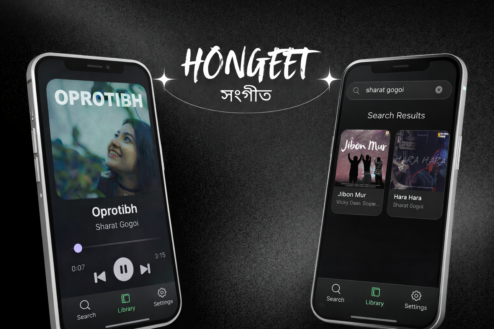

**<h1 align=center> HONGEET - সংগীত 🎧</h1>**

> A lightweight, high-quality music streaming & offline player — built with love for speed, control, and clean design.

   
  
    
  

---

> [!IMPORTANT]
> Hongeet is in active development. Expect bugs, crashes, and missing features. If you come across into any bugs or any issues, please report them in the [Issues](https://github.com/greenbugx/Hongeet/issues)

_HONGEET is a **local-first music app** that lets you  
**stream** and **download** music with maximum control — no ads, no trackers, no nonsense._

Built for people who care about **audio quality**, **performance**, and **ownership**.

<h2 align=center> 📖 Whats HONGEET? </h2>

HONGEET was built to solve a simple problem:

> *“Why is it so hard to just listen to music the way **I** want?”*

Most music apps:
- lock downloads behind paywalls
- restrict quality
- track users aggressively
- break when you go offline

HONGEET does the opposite.

It runs a **local backend inside the app**, streams directly from the source, and lets **you** decide what happens to your music.

---

<h3 align=center> 📸 Screenshots </h3>

  
  
  

  
  
  

  
  

  
  

---

<h2 align="center">✨ Features</h2>

  <h3>🎶 Streaming</h3>
  <ul>
    <li>High-quality audio streaming </li>
    <li>Smart URL caching (faster repeat plays) </li>
    <li>Gapless playback with queue management</li>
  </ul>

 

  <h3>📥 Downloads</h3>
  <ul>
    <li>Download songs directly to device storage </li>
    <li>YouTube extraction powered by youtube_explode_dart </li>
    <li>Offline playback from local files</li>
  </ul>

 

  <h3>🧠 Smart Playback</h3>
  <ul>
    <li>Recently Played history </li>
    <li>Loop modes (off / all / one)</li>
  </ul>

 

  <h3>🖤 UI / UX</h3>
  <ul>
    <li>Glassmorphism-inspired design </li>
    <li>Smooth animations </li>
    <li>Full-screen player with blur background </li>
    <li>Mini player support</li>
  </ul>

 

  <h3>🔐 Local-First</h3>
  <ul>
    <li>No external backend servers </li>
    <li>Everything runs on-device </li>
    <li>Your music stays with you</li>
  </ul>

<h2 align="center">🔐 Permissions</h2>

HONGEET only asks for permissions needed for playback, downloads, and local media access:

>- `INTERNET`  
  For streaming audio and fetching music metadata.
>
>- `POST_NOTIFICATIONS` (Android 13+)  
  For playback controls in notification/lock screen and download notifications.
>
>- `FOREGROUND_SERVICE`, `FOREGROUND_SERVICE_MEDIA_PLAYBACK`, `WAKE_LOCK`  
  To keep background playback stable while the app is minimized or screen is locked.
>
>- `FOREGROUND_SERVICE_DATA_SYNC`  
  To support background data tasks such as download/stream sync operations.
>
>- `READ_MEDIA_AUDIO` (Android 13+)  
  To read audio files from device storage (downloads/local tracks).
>
>- `READ_EXTERNAL_STORAGE` (Android 12 and below)  
  Backward-compatible local audio access on older Android versions.
>
>- `REQUEST_IGNORE_BATTERY_OPTIMIZATIONS`  
  Optional: used to open battery optimization settings on aggressive OEM devices.
  This is user-controlled and only requested to improve background playback reliability.

HONGEET does not request contacts, location, microphone, or camera permissions.

---

<h2 align=center> 🤝 Contributing </h2>

Contributions are welcome.

You can help by:

- Reporting bugs
- Improving UI/UX
- Optimizing performance
- Reviewing code

### How to contribute?

- Fork the repo
- Create a feature branch
- Commit clean, meaningful changes
- Open a Pull Request

_For detailed info about Contributing to this project, please check [CONTRIBUTING](CONTRIBUTING.md)_

---

> [!WARNING]
> Hongeet is a personal project built for learning and fun. It is not intended for commercial use or distribution. Please do not use it to host or distribute copyrighted content without proper permissions. If you are a rights holder and believe something is wrong, please open an issue

---

<h2 align=center> 📜 License </h2>

_This project is licensed under the GNU-AGPLv3 or later. Check [LICENSE](LICENSE) for License info._

---

<h2 align=center> ❤️ Credits & Thanks </h2>

Huge respect and thanks to:

- [youtube_explode_dart](https://github.com/Hexer10/youtube_explode_dart) -> for YouTube stream extraction in pure Dart
- [Saavn API (Unofficial)](https://github.com/sumitkolhe/jiosaavn-api) -> for JioSaavn metadata & streaming access

This project wouldn’t exist without them.

---

<h2 align=center> <em>Now dont cry listening to sad songs :)</em> </h2>
